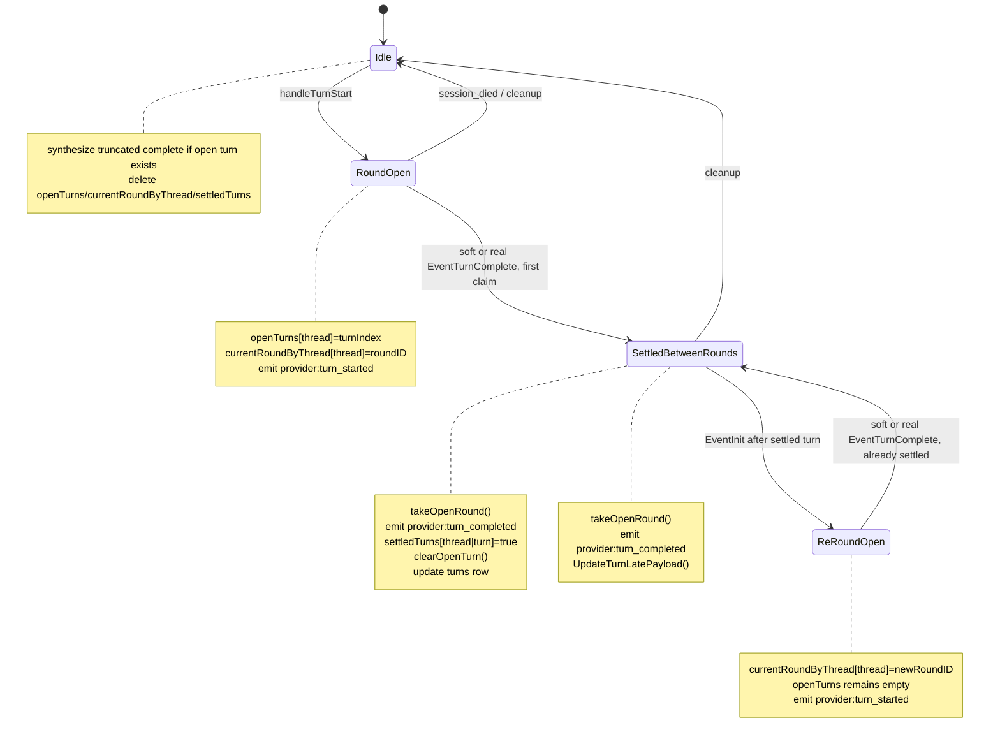

# Turn / Tool / Task Lifecycles

The single source of truth for how agent-overflow models the three
independent lifecycles that govern a chat turn. Read this before
touching `internal/provider/{claude,codex}/`, `internal/triage/`, or
any frontend code that reads `pane.activeTurn` / tool-call state.

## The three lifecycles

Provider output is governed by three **independent** lifecycles. Each
has its own identity, its own terminal signal, and its own
persistence target. Conflating them is the root cause of most chat-UI
bugs (rows stuck at `running`, "Working…" pinned forever, turns that
never complete).

| Lifecycle | Identity | Terminal signal | Storage |
|---|---|---|---|
| **Tool** | `tool_use_id` | provider `tool_result` / `item/completed` | `items` row, `kind="tool_call"` |
| **Task** | `task_id` (Claude only) | `task_updated` terminal; TaskOutput can enrich/fallback | `items` row, `kind="tool_completion"`, `completion_of=<launch_id>` |
| **Turn** | thread-scoped AO `turn_id` (`provider_turn_id` retains Codex's wire id) | provider `result` / `turn/completed` | `turns` row |

The rules below say when each lifecycle fires, what owns its state,
and how the signals interact.

## 1. Tool lifecycle

**One-to-one with every `tool_use` on the wire.** Every tool
invocation the agent makes produces exactly one `tool_call` row.

### Invariant (load-bearing)

> Every `tool_use` emits exactly one `EventToolStart` and exactly one
> `EventToolComplete`, both keyed by the tool's own `tool_use_id`.
> No ID rewriting between start and complete. No consumption by other
> event handlers. No skipping.

### Applies equally to

- Inline tools (Read, Grep, Edit, inline Bash): completion carries
  the exit/stdout result.
- Backgrounded Claude tools (Bash with `run_in_background:true`,
  Task subagent): completion is the **placeholder** tool_result
  (`backgroundTaskId: ...`); actual task result lands via the task
  lifecycle (below).
- TaskOutput: a regular inline tool the agent may call to retrieve a
  still-retained background task. Its own `tool_use_id`'s completion
  is the retrieval result. Any background-task details it surfaces are
  additive and must not replace the TaskOutput tool row.
- Codex tools (shell, mcp, fileChange, collab spawn/wait/resume/close)
  all complete via `item/completed`.

### Status flipping on completion

| Backgrounded? | Placeholder behavior | Launch row status after completion event |
|---|---|---|
| No (inline) | N/A | `completed` / `errored` |
| Yes (Claude Bash or Task) | Placeholder `tool_result` carries `backgroundTaskId` | Stays `running` per spec invariant. Sibling `tool_completion` row arrives later via task lifecycle. |

This per-spec exception exists so the timeline can render both
"agent dispatched this tool" and "the actual work that got done" as
two historically accurate rows. The launch row's `status='running'`
+ `is_background=true` is the render signal for the `"…"` badge
(see [chat-rewrite.md §Background tray](chat-rewrite.md)); it is not
a claim that the tool is currently executing.

### Codex background projection

Codex has no `run_in_background` flag, but it still has backgrounded
work. Triage may stamp `is_background=true` only from wire-typed
signals:

- A typed `TerminalInteraction` notification for an empty `write_stdin` poll
  targets a `unifiedExecStartup` process, proving the model explicitly waited
  on the live background PTY.
- MultiAgentV1 `collabAgentToolCall` `spawn_agent` whose `agentsStates`
  reports a non-terminal child, or MultiAgentV2's canonical
  `subAgentActivity kind:"started"` after successful child creation. The V2
  adapter normalizes that activity into the same receiver/running-state shape.

Codex command executions do not follow Claude's sibling completion contract:
when Agent Overflow persists a command execution, typed `item/completed`
updates the original command row. Codex `spawn_agent` is different: the parent
launch row is only the completed "spawned" event. Child-agent terminal state is
shown by a separate `tool_completion` sibling created from `wait_agent` or
injected `<subagent_notification>` fragments. Direct child lifecycle
notifications only update live/incomplete state so later explicit wait or
notification output can own the visible transcript boundary.

Every non-root Codex provider thread is fail-closed at the session boundary.
Until a V1 spawn completion or V2 started activity maps it to a spawn item,
its notifications and server requests are quarantined with bounded storage
and an ownership deadline; expired server requests are rejected rather than
stalling the provider indefinitely. Known child turn
lifecycle and thread-wide state never enter the parent projection; only
transcript-bearing events cross with `ParentToolUseID`. The same rule applies
recursively when a child spawns a grandchild.

Codex `unifiedExecStartup` command executions are the exception to the
persisted-launch-row shape. Their starts are tracked as transient
running-tray state so the user can see the command immediately, but
they are not written into transcript history at start time. Typed
`item/completed` clears the transient tray state and persists the command row
with the original item id only while a Codex wire round is active, matching
Codex TUI timing. Raw `exec_command` output may enrich live process metadata,
but it does not create, delay, or reorder command history. Empty `write_stdin`
polls persist separate terminal-interaction marker rows only while the command
tracker is still live.

The retired `BackgroundClassifier` heuristic must not come back.
Background authorization comes from the wire fields above; model
text/thinking or turn completion is only the trigger that marks an
already-authorized launch as having moved to the background.

### Force-close safety net (turn-complete)

When a turn ends, triage force-closes any `tool_call` rows with
`status='running' && !is_background && turn_index=currentTurn` to
`status='errored'` with a synthesized completion. This handles
provider bugs where a `tool_result` is dropped. Backgrounded
launches are exempt. They legitimately stay `running`.

## 2. Task lifecycle (Claude only)

Backgrounded tasks produce a **separate** event stream keyed by
`task_id`. This is strictly additive: it layers task-completion
details on top of the tool-call row; it never replaces the tool
lifecycle.

### Participants

- `system/task_started`: mirrors the mapping `task_id ↔ tool_use_id`
  into `items.meta.task_id` so reconnect can correlate by task_id
  alone.
- `system/task_updated` with `patch.status` in
  `{completed, failed, killed}`: **authoritative lifecycle
  terminal**. Emits `EventBackgroundTaskTerminal`.
- `user` tool_result for TaskOutput with
  `tool_use_result.task.status` terminal: explicit agent retrieval of
  a still-retained task. It can carry `exitCode`, `output`, `result`,
  `description`, and sometimes `output_file`. It is useful as
  enrichment/fallback, but the UI lifecycle must not depend on the
  agent choosing to call it.
- `system/task_notification`: **not a completion source**. It is an
  agent notification. It may carry `summary` and `output_file` that the
  UI can render as a separate notification row, but it must not mutate
  task completion state. See
  [claude-wire.md §task_notification](../references/claude-wire.md#systemtask_notification).

### Live progress, mid-flight backgrounding, and the level set

Three additional `system/*` pushes ride the same `task_id` keyspace.
None of them is a lifecycle transition, and none may be treated as one.

- **`system/task_progress`: live only, never history.** The CLI emits a
  tick after every tool round the subagent completes, carrying
  cumulative `usage{total_tokens, tool_uses, duration_ms}` plus the
  agent's `description` and `last_tool_name`. The parser resolves the
  tick's `task_id` to the LAUNCH `tool_use_id` and emits
  `EventSubagentProgress`; triage MERGES it into an in-memory entry
  keyed `(threadId, itemId)` and fans it out on
  `provider:subagent_progress`. Nothing is written per tick: persisting
  a row per tool round for work the provider already records is exactly
  what principle 3 forbids. The FINAL numbers land once, on the launch
  row's `meta.subagentProgress`, when the launch reaches its terminal
  (`persistSubagentFinalProgress`), which is also where
  `task_notification`'s authoritative `usage` block folds in. A tick
  whose `task_id` this parser cannot resolve (it reconnected mid-agent)
  is dropped with a log line, never emitted with an empty `ItemID`,
  which would address the wrong row.
- **`system/task_updated` with `patch.is_backgrounded: true` and NO
  `patch.status`: stamps the launch row.** This is the only wire-typed
  statement that a FOREGROUND agent was moved to the background
  mid-flight, i.e. the moment ordinary sidechain forwarding stops. It emits
  `EventSubagentBackgrounded` on the launch `tool_use_id`; triage flips
  `is_background` on the launch row and stamps
  `meta.subagentBackgroundedAt` with the cut timestamp. New Claude sessions
  continue the agent's rows live through `transcript_mirror`; the stamp is
  the detached-state fact, not a streaming-pause marker. It is NOT a
  terminal and must not clear the task's liveness: the §E5 async ack that
  follows still needs to carry `is_background: true`. A patch that DOES
  carry a terminal `status` takes the terminal path above unchanged.
- **`system/background_tasks_changed`: a LEVEL set, and a tray nudge.**
  The payload's `tasks` array is the provider's FULL replacement set of
  currently-backgrounded tasks, not a delta, and the distinction between
  an ABSENT `tasks` key (no statement, dropped) and an EMPTY array (a
  real "nothing is backgrounded now") is load-bearing, exactly as it is
  for `commands_changed`. It emits `EventBackgroundTasksChanged`, which
  triage forwards on the shared `provider:background_tasks_changed`
  channel Codex already uses. Consumers treat any frame as a nudge to
  refresh their tray listing; the set rides along so a consumer that
  wants reconnect-safe membership can read it without a round trip. It
  is not a completion source and never mutates a row.

AO can also DRIVE this transition rather than only observe it:
`Session.BackgroundTask` sends `control_request{subtype:
"background_tasks", tool_use_id}` and verifies
`response.backgrounded == true`. A `false` is the provider saying no
foreground task matched, which is an error, not a silent no-op.
`App.BackgroundClaudeTask` is the bound method behind it (local-only,
same class as `StopClaudeTask`). The `task_updated` and
`background_tasks_changed` pushes arrive BEFORE the control response, so
the row is already stamped by the time the call returns.

### Inline `local_agent` launches emit this lifecycle too

`system/task_started` fires for EVERY Bash/Task invocation, foreground
(awaited) and backgrounded alike. Consequently a `local_agent`
(Task/Agent tool) launch that completes INLINE via its own real
`tool_result` (no `is_background` on the launch) still gets a later
`system/task_updated` terminal and `system/task_notification` for the
same `task_id`. Those signals reach `writeBackgroundCompletionSibling`
exactly as a real backgrounded launch's would; the function's
`!launch.IsBackground` early return is what keeps an inline launch from
getting a redundant `tool_completion` sibling alongside its
already-completed launch row. See
[claude-wire.md §E5 "Async local_agent launch (bare ack)"](../references/claude-wire.md#user-message-tool_result-blocks)
for the additional async-ack launch shape this applies to.

### Resuming an idle async agent: the SendMessage rebind carrier

An async `local_agent` launch (previous section) goes idle once it
finishes and can be resumed by the model calling the harness's resume
tool (observed: `SendMessage`, `input.to: <agentId>`). The CLI reacts
by re-firing `system/task_started` with the SAME `task_id` but the
resuming tool's OWN `tool_use_id`, carrying the ORIGINAL agent's
`description`/`subagent_type`. See
[claude-wire.md §E6 "Resuming an idle async agent"](../references/claude-wire.md#user-message-tool_result-blocks)
for the full wire shapes.

AO embraces the rebind instead of routing the resumed lifecycle back
to the original launch: the resuming tool_use becomes the resumed
round's **background carrier**.

- The parser lets `rememberTaskToolUse` rebind normally (no
  first-binding-wins) and marks the resuming tool_use backgrounded via
  the same mechanism `run_in_background` launches use, so its own
  `tool_result` ack, which carries no async marker of its own,
  still emits `EventToolComplete{is_background:true}`.
- Triage's keep-running flip (§1 above, the `!launch.IsBackground` →
  `IsBackground` transition) additionally rewrites the carrier's
  `Summary` to the resumed agent's identity (`"Agent: <description>"`,
  preferring the original launch row's own Summary when it's still
  around) whenever the launch row's meta carries
  `resumes_tool_use_id`, stamped by the parser's enriched
  meta-only `EventToolStart` for the rebind `task_started`. Without
  this the carrier would read "SendMessage -> done" instead of
  identifying the agent it's resuming.
- Round 2's `task_updated`/`task_notification` then write a NEW
  `tool_completion` sibling under the carrier
  (`"complete:"+carrierID`, distinct from round 1's
  `"complete:"+originalLaunchID`) through the SAME `writeBackgroundCompletionSibling`
  path, with no special-casing needed there.

Why: the idle-session reaper (`app_session_reaper.go`) keeps a quiet
session alive only while `ListRunningBackgroundToolCalls` is
non-empty. The ORIGINAL launch already has its round-1 sibling once
round 1 completes, so it can never satisfy that predicate again. If
nothing else is backgrounded, a quiet resumed agent would get its
whole session reaped mid-run without the carrier. The original launch
row and its round-1 sibling are untouched by round 2; the original
stays hidden from the tray (its own sibling excludes it), and the
CARRIER is what surfaces there during round 2, with the agent-centric
summary.

**Known edge**: if the parser restarts and loses BOTH the
`taskToolUses` binding AND the `agentLaunchToolUses` launch-tool
marker for the resuming tool (a double restart mid-stream), the resume
is undetectable from that instance's state alone and the round is
reaper-unprotected. Not engineered around. See the parser's
`task_started` case comment.

### Merge rule

`task_updated` and TaskOutput can arrive for the same `task_id`.
Fresh spikes show `task_updated` arrives before the TaskOutput
`tool_result` when TaskOutput blocks on a running task. A plain
`task_updated` can also arrive without any TaskOutput call at all.

Triage must coalesce by stable completion id and preserve richer
existing payload data if a later poorer signal arrives. No parser-level
dedup is required, but store-level merging must be monotonic: status
can move to terminal, but output/exit-code/output-file data should not
be erased by a later lifecycle-only event.

### Tray decoupling: process state vs. agent observation (Tray-A)

The tray reflects **process state** ("is this background process
still running on the host?") while the chat reflects **agent
observation state** ("has the agent observed completion?"). The two
diverge when the host process exits but the agent hasn't yet noticed
(e.g. a backgrounded `sleep 30` finishes mid-turn while the agent is
still streaming text). Splitting the two prevents the chat from
"lying" by showing a completion row at process-exit time, before the
agent has actually seen it.

Implementation:

1. **`task_updated`** with status in `{completed, failed}` writes a
   row to `pending_background_task_terminals` (PK
   `(thread_id, task_id)`). The tray query `ListLiveBackgroundTasks`
   joins against this table with `NOT EXISTS` on `tool_use_id`, so
   the launch drops out of the tray immediately. **No chat row is
   written yet.** Triage emits
   `provider:background_task_state{state:"exited"}` so the frontend
   can refresh.
2. **Agent observation**, either `system/task_notification` (the model
   sees the queued attachment on the next iteration) or a
   `TaskOutput` `tool_result` (the model explicitly polled), drains
   the stash via `TakePendingBackgroundTerminal` and, **only when the
   launch is actually backgrounded** (`launch.IsBackground`), writes
   the `tool_completion` sibling at the current write head and emits
   `provider:background_task_state{state:"drained"}`. An INLINE launch
   (see above) still drains the stash (the drain is the load-bearing
   side effect keeping `pending_background_task_terminals` from
   leaking) but writes no sibling and emits no `"drained"` event; that
   is safe because `ListLiveBackgroundTasks` never surfaces a
   foreground launch in the first place. After a real backgrounded
   drain, the tray surfaces both rows joined together until they age
   out via retention. When the `task_notification` event itself performs
   the drain, the sibling is written (and reaches the wire) **before**
   the notification row: the frontend hides the report-bearing
   notification row only once a completed lifecycle row with the same
   `task_id` exists (`notificationFilter.ts`), so notification-first
   emission flashed the agent's full report into the timeline for one
   flush and yanked it back out on the next
   (bug-report-20260801T024731Z).
3. **`task_updated` with `status="killed"`** is a deliberate carve-out:
   the `killed` status is only reached via the user's explicit
   `stop_task` (the StopClaudeTask binding behind the tray's Stop
   button). The user already knows the process was stopped (there's
   nothing for the agent to "observe"), so triage skips the stash and
   writes the sibling immediately so chat shows the killed badge
   without waiting for a future turn.

### Crash recovery: recoverable Claude background launches

If the previous app instance died while a Claude backgrounded launch was
still in `status='running'`, the agent will never observe its
completion (the owning Claude session is gone). Without intervention
the launch would render as "running" forever in chat and tray.

`Router.RecoverOrphanedBackgroundTasks` runs once during
`App.ServiceStartup`. It queries
`Store.ListRecoverableClaudeBackgroundLaunches` for every `claude` or
`claude-tui` `tool_call` row that is `status='running'`, still live,
and has no completion sibling. For each one it writes the
`tool_completion` sibling directly with `source="session_died"`. When a
`pending_background_task_terminals` stash exists for the launch it
drains and merges the real captured outcome; otherwise it falls back to
`status="killed"` (the launch was running when the app died, so "we
killed it at shutdown" is the closest truthful state). Writing the
sibling is the same terminal step the steady-state observation path
takes after draining a stash, so the recovery path reuses
`writeBackgroundCompletionSibling` end-to-end. Idempotent and
crash-safe: if the process dies mid-sweep, the launch row is still
`status='running'` with no sibling, so the next boot's sweep finds it
again.

A `task_id` is **not** required. The synthetic completion sibling is
keyed off the launch id (`backgroundCompletionID` returns
`"complete:"+launchID`), so it is idempotent with or without one, and
the `task_id` only gates the (task-id-keyed) stash drain above. This
matters for `claude-tui`: the interactive provider reconstructs
`is_background=1` from the tool_use input but never reconstructs
`system/task_started`, so its backgrounded launches carry no `task_id`.
Requiring one is exactly what left them rendering "running" forever
after a restart.

Codex background projections use a different lifecycle. Inactive Codex
rows can remain `status='running'` with
`live_background_active=false`; they are hidden from live-background
queries and are owned by the Codex ghost-flip/reconcile path, not this
Claude task recovery sweep.

### Output

Triage writes a `tool_completion` row:
- `id` = `"complete:<launch.id>"` (stable; idempotent upsert)
- `completion_of` = the backgrounded tool's launch `tool_use_id`
- `kind` = `"tool_completion"`
- `status` = `completed` / `errored` / `killed`
- payload metadata may include `{output_file, exit_code, end_time}`
- payload data may include TaskOutput `task.output` / `task.result`
  when the agent explicitly retrieved it, or a lazy pointer to
  `task_notification.output_file` when the notification is available

### Task-lifecycle events can outlive the owning turn

A `task_updated` for a backgrounded task can arrive AFTER the
turn that launched it has completed. Triage writes the
`tool_completion` row at the current thread write head when one is
open, otherwise at the latest persisted turn. The tray renders it on
its own retention clock. See
`docs/references/fixtures/claude/ndjson_outlives.log` for a captured example.

### Desired chat-history contract

The UI should not expose Claude/Codex implementation differences. The
history contract is:

- The launch row stays where the agent made the call. Once backgrounded
  it renders a `...` badge and appears in the background tray.
- The launch row does not flip to completed when background work ends;
  it remains the historical "started background work" row.
- A separate `tool_completion` row appears where the completion was
  presented to the agent/user stream. If completion lands while
  assistant text is streaming, defer the row until the active streaming
  block closes so the transcript stays readable.
- The completion row shows success/failure/stopped in collapsed form.
  Expanding the row lazy-loads output details when available. Keep
  large command output out of the always-loaded timeline window.
- Provider notification rows, such as Claude `task_notification` and
  Codex terminal/subagent notifications, may render as muted chat
  markers. They never decide lifecycle state.

## 3. Turn lifecycle

One-to-one with a user → assistant round-trip. The authoritative
"is the agent currently working?" signal.

### Participants

**Claude**:
- Turn start: `SendMessage` registers a pending-send marker, then
  Claude's wire `system/init` drives `handleTurnStart` through
  `handleInit`.
- Turn end: `result` envelope. Carries `subtype`, `stop_reason`,
  `usage`, `duration_ms`, `total_cost_usd`, `modelUsage`,
  `permission_denials`, `terminal_reason`.
- Final assistant message id: NOT on `result`. Track from the last
  `assistant` envelope's `message.id`.
- Soft round-close: a top-level `stream_event.message_delta` with
  `delta.stop_reason` in `{end_turn, stop_sequence, refusal}` closes
  the current wire round before the trailing `result` arrives.

**Codex**:
- Turn start: `turn/started` notification.
- Turn end: `turn/completed` notification.
- `turn/completed` shape: `{threadId, turn}`. The lifecycle status is
  `turn.status` (`completed`, `failed`, `interrupted`, `inProgress`).
- Final assistant message id: not carried on `turn/completed`.

### Emitted events

- `EventTurnStart` → triage → `provider:turn_started` to frontend,
  writes turn row with `completed_at=null`.
- `EventTurnComplete` → triage → `provider:turn_completed` to
  frontend, updates turn row, force-closes orphan non-background
  running tool_calls.

### Wire-round vs logical-turn cadence

`provider:turn_started` and `provider:turn_completed` fire **per wire
round**, not per logical turn. A round corresponds to one provider
stop signal: Claude `result`, Claude soft message_delta stop_reason,
or Codex `turn/completed`. A logical agent-overflow turn (one
user-typed prompt) can span multiple
rounds. The canonical multi-round case is Claude's CLI synthesizing a
`type:"user"` envelope from a `task_notification`: the assistant's
first `end_turn` lands as result envelope #1, the synthesized prompt
provokes another model call, and the second response lands as result
envelope #2 (the `interactive_outlives_taskoutput_monitor.ndjson`
fixture captures seven such envelopes in one logical turn).

Two cadences run in parallel:

| Cadence | Driver | Granularity | What it controls |
|---|---|---|---|
| Frontend visibility | `currentRoundByThread` / `setOpenRoundSnapshot` / `takeOpenRound` | Per wire round | `provider:turn_started`/`provider:turn_completed` emissions: working indicator, Stop button, composer block, read-state projection |
| Persistence | `claimTurnSettlement` / `settleTurnRow` | Per logical turn (turnIndex) | `turns` row UPDATE, streaming-item settlement |

Round entry points:

- **`handleTurnStart`** opens round 1 of every logical turn. It calls
  BOTH `setOpenTurn` (per-turn flow-control + counter re-init) AND
  `setOpenRoundSnapshot` (per-round id allocation), then emits
  `provider:turn_started` with the per-round uuid as TurnID.
- **`handleInit` re-round branch** opens rounds 2+ when an
  `EventInit` arrives for a thread whose current logical turn is
  already settled (`settledTurns[turnKey]==true`). Calls
  `setOpenRoundSnapshot` only, and does NOT call `setOpenTurn`. This is
  load-bearing: id-allocating counters must survive across the
  multi-result-per-turn boundary so post-round-1 rows don't collide
  with rows already persisted under the same logical turn (see
  `internal/triage/multi_result_test.go`).
- **`handleTurnComplete`** uses `takeOpenRound` (read-and-clear) to
  decide whether to emit. An empty slot means a synthetic complete
  already raced ahead (the fatal-error-then-real-result pattern in
  `handleError`); the second wire complete then emits nothing, so
  the frontend sees exactly one `turn_completed` per round.
  Persistence work stays gated by `claimTurnSettlement` at logical-turn
  granularity.

The persisted `turns.turn_id` stays on `resolveTurnID` (logical-turn
granularity) so multi-round logical turns share a single row.



Cascade shapes pinned by fixtures/tests:

- Single round soft → real: soft emits `provider:turn_completed` and
  settles; trailing real result folds usage / final assistant id only.
- Multi-result real → init → real: first real settles; init opens a
  re-round; second real emits round completion and folds late payload.
- Soft + subagent wait + init + real: soft clears working UI; later
  init/re-round and real behave as above.
- Soft + init + soft + init + soft + real: each init opens one new
  round; each soft closes that round; trailing real folds final payload.

### Invariant (load-bearing)

> **Turn state is wire-pushed.** The UI's "Working…" indicator and
> active-turn flag come exclusively from provider-pushed
> `EventTurnStart` / `EventTurnComplete` (per wire round; see above).
> Never derive turn activity from item state (e.g. "some tool_call
> is still running, so the turn must be active"). A dropped
> completion must not freeze the UI.

### Turn-level projections

The `turns` row carries:
- `turn_id` (AO's thread-scoped durable id)
- `provider_turn_id` (the verbatim provider id when one exists; empty for
  Claude and inferred import turns)
- `thread_id` FK
- `turn_index` (incrementing per-thread counter)
- `started_at` (ms)
- `completed_at` (ms, nullable; null = turn is in-flight right now.
  Crash leftovers are settled as `interrupted` by the boot sweep, per
  §Crash behavior, so null never survives an app restart)
- `stop_reason` (text: `end_turn` / `max_tokens` / `tool_use` /
  `stop_sequence` / `refusal` / `error` / `interrupted`)
- `assistant_message_id` (text, nullable): provider-derived final
  assistant message id when available. Claude derives it from the last
  in-stream assistant `message.id`; current Codex `turn/completed`
  does not carry one.
- `token_usage_json`: the turn's per-turn usage delta (aggregate
  across models; the per-model split lands in `usage_ledger`).
  First-non-empty-wins across multi-result settles.
- `error_message`: populated when `stop_reason` indicates error.

### Crash behavior

A provider crash while the app is alive settles its turn: the session
teardown synthesizes a truncated turn-complete, which writes
`completed_at` + `stop_reason='interrupted'` and flips the turn's
streaming/running items to errored.

An **app** crash mid-turn skips all of that and leaves the latest
`turns` row with `completed_at=null` plus stranded streaming/running
items. `Router.RecoverCrashedTurns` runs once during
`App.ServiceStartup` (before any provider session can spawn, so every
null row is provably crash residue) and performs the same settle the
in-app path would have: `completed_at=now`,
`stop_reason='interrupted'`, item flip with the " — interrupted"
suffix (backgrounded launches exempt, since the background recovery sweep
below owns those). One transaction, O(crashed rows) via the partial
index `idx_turns_inflight`. Without this sweep the null row wedges
`GetActiveTurn`-guarded flows, most visibly revert, whose "interrupt
the current turn" error is unsatisfiable when no session exists to
interrupt.

Post-sweep, a `completed_at=null` row during an app run means
genuinely live provider work. The durable "interrupted" signal that
survives restarts is `stop_reason='interrupted'`; the sidebar's boot
pill (`Thread.HasIncompleteTurn`) covers both encodings: an unseen
in-flight turn, or an unseen settled-interrupted turn.

The frontend still shows no active-turn spinner for any of this
(spinner requires a live `activeTurn` push, not a DB row), and we do
NOT reconcile by probing the session (see §Non-goals).

If a later turn exists for the same thread, any older
`completed_at=null` row is no longer eligible to mean "active"; it is
historical corruption from a dropped/faulty completion and is ignored
by backend active-turn checks (and settled by the same boot sweep).

### Non-goals: no session-liveness probing

The UI does NOT probe provider session liveness to infer turn
state. A session can legitimately have backgrounded tasks still
running while its owning turn has completed (common case:
`run_in_background:true` Bash that outlives `result`). Probing for
"is the process still alive" tells you nothing useful about turn
state. Session probe code exists at
`internal/provider/codex/session_probe.go` for recovery/resume use
cases only. It must not feed turn detection.

## Event table (wire → internal → frontend)

| Wire envelope | Internal event (Go) | Frontend event | Triage action |
|---|---|---|---|
| Claude `tool_use` | `EventToolStart` | `provider:item_event` upsert | Upsert `tool_call` row, status=running |
| Claude inline `tool_result` | `EventToolComplete` | `provider:item_event` upsert | Update `tool_call` to terminal |
| Claude bg placeholder `tool_result` | `EventToolComplete` | `provider:item_event` upsert | Per-spec: keep `status=running`, record `is_background=true` |
| Claude `system/task_started` | `EventToolStart` (meta-only) | `provider:item_event` upsert | Merge `task_id` into `items.meta` |
| Claude `system/task_updated` terminal | `EventBackgroundTaskTerminal` | `provider:background_task_state` exited | Stash terminal in `pending_background_task_terminals`; no chat sibling yet |
| Claude TaskOutput `tool_result` | `EventToolComplete` + optional `EventBackgroundTaskTerminal` | `provider:item_event` upsert | Close TaskOutput row; drain stash and write/enrich sibling when terminal data is present |
| Claude `system/task_notification` | `EventBackgroundTaskNotification` (+ `meta.usage` when present) | `provider:item_event` upsert (notification row, backgrounded top-level launches only) | No lifecycle state mutation; the authoritative `usage` folds into the launch row's final `meta.subagentProgress` |
| Claude `system/task_progress` | `EventSubagentProgress` | `provider:subagent_progress` | LIVE ONLY: merged into an in-memory entry per launch, fanned out, never persisted per tick; final numbers persist on the launch row at its terminal |
| Claude `system/task_updated` `patch.is_backgrounded` (no status) | `EventSubagentBackgrounded` | `provider:item_event` patch | Flip `is_background` on the LAUNCH row + stamp `meta.subagentBackgroundedAt`; not a terminal, liveness stays armed |
| Claude `system/background_tasks_changed` | `EventBackgroundTasksChanged` | `provider:background_tasks_changed` | LEVEL set: forwarded as a tray nudge carrying full membership; absent `tasks` key is dropped, empty array is a real empty set; no row written |
| Claude `result` | `EventTurnComplete` | `provider:turn_completed` | Update `turns` row, force-close orphans |
| Codex `item/started` | `EventToolStart` | `provider:item_event` upsert for persisted items | Upsert item row; `unifiedExecStartup` starts stay transient tray state |
| Codex `item/completed` | `EventToolComplete` | `provider:item_event` upsert for persisted items | Update item row; unifiedExec completion clears live state and only persists while a Codex wire round is active |
| Codex `turn/started` | `EventTurnStart` | `provider:turn_started` | Insert `turns` row |
| Codex `turn/completed` | `EventTurnComplete` | `provider:turn_completed` | Update `turns` row, force-close orphans |

## Frontend state shape

The frontend splits "live turn metadata" between a global registry
and a per-pane settlement record:

```ts
interface ActiveTurn {
  turnId: string;
  turnIndex: number;
  startedAt: number;
}
interface SettledTurn {
  turnId: string;
  turnIndex: number;
  startedAt: number;
  completedAt: number;
  stopReason: string;
  assistantMessageId: string | null;
  tokenUsage: {
    inputTokens: number;
    outputTokens: number;
    cacheReadInputTokens?: number;
    cacheCreationInputTokens?: number;
    totalCostUsd?: number;
  } | null;
  aborted: boolean;
  errorMessage: string;
}

// Global, keyed by threadId. Lives in
// frontend/src/lib/stores/threadStatuses.svelte.ts. Both the
// chat working indicator AND the sidebar pill read from here.
getActiveTurn(threadId): ActiveTurn | null

// Per-pane. Carries the latest settled-turn projection for read-state
// and trace/debug consumers.
pane.latestSettledTurn: SettledTurn | null
```

**Single source of truth.** `ActiveTurn` lives only in the global
registry, never on `ThreadPane`. The pane exposes `pane.activeTurn`
as a transparent shim onto `getActiveTurn(pane.threadId)` so existing
readers don't change shape, but no per-pane copy of the data exists.
This avoids the bug where switching threads cleared the per-pane
`activeTurn` while the global store still held the live record.
The chat working indicator would go dark on a thread the backend
was actively working on.

`aborted` and `errorMessage` on `SettledTurn` remain part of the
settled-turn projection for read-state and trace/debug consumers. The
chat transcript no longer renders a settled-turn divider from this state;
the visible "Response" divider is structural and appears when assistant
text first follows tool activity in the same turn.

### `isTurnActive` replacement

```ts
// Pre-refactor (REMOVED)
get isTurnActive() {
  return items.some(/* running tools, streaming text, approvals */);
}

// Post-refactor
get isTurnActive() {
  return getActiveTurn(this.threadId) !== null;
}
```

### Rehydration on thread switch

On `SwitchThread`, the frontend calls `ListRecentTurns(threadId, 2)`
to rehydrate `latestSettledTurn` from the DB. The global active-turn
registry is NOT rehydrated from persistence. It's only set on live
`provider:turn_started` events. A crashed turn rehydrates as "turn
was interrupted", not "turn is currently active": the boot sweep has
settled it with `stop_reason='interrupted'` (see §Crash behavior), so
it surfaces through the normal settled-turn projection. When the user switches AWAY from a thread with a live
turn and back, the indicator returns because the global registry
held the record across the switch, and nothing in pane lifecycle
clears it.

### Per-thread send queue

The composer is always-typeable. When the user submits a message
mid-round (`getActiveTurn(threadId) !== null`), it lands in the
per-thread send queue (`frontend/src/lib/stores/sendQueue.svelte.ts`)
instead of dispatching `SendMessageWithOptions` immediately. The
queue is in-memory only (`SvelteMap<threadId, QueueItem[]>`),
keyed identically to the global active-turn registry, and survives
thread switches.

`QueueItem` captures everything needed to dispatch the message
later: `message`, full `attachments` (not ids: click-to-edit
needs to restore them into the composer without a backend
round-trip), `terminalChips`, and plan-revision metadata
(`sourceProposedPlan`, `revisionSourceProposedPlan`,
`revisionSourceCommentIds`).

**Drain trigger.** Every `provider:turn_completed` listener fires
`tryDrainNextQueued(threadId)` after the existing
`projectTurnCompleted` call. Drain is uniform across cause
(success, error, or aborted), matching both reference UIs:

- Claude Code's `useQueueProcessor` flips on every `!isQueryActive`
  transition (`src/hooks/useQueueProcessor.ts`).
- Codex's `maybe_send_next_queued_input` is called from 11 sites
  (`codex-rs/tui/src/chatwidget.rs`), every state-clearing
  transition.

Stop-with-queue ("user hits Esc with messages queued") falls out of
the same uniform rule: `InterruptTurn` → backend emits an aborted
`turn_completed` → drain fires → first queued item is dispatched as
the next user message. No special-case wiring.

**Drain sequence.**

1. `provider:turn_completed` arrives → `activeTurn` cleared.
2. `popFront(threadId)` → head item lifted; if undefined, return.
3. `projectSendStarted(threadId)` → `pendingSendThreads.add`.
   The working-indicator bridge predicate keeps the spinner up
   across the RPC roundtrip (see below).
4. `await SendMessageWithOptions(...)`, typically 50–200ms.
5. Success → backend emits `provider:turn_started` → existing
   `projectTurnStarted` handler clears `pendingSendThreads`.
6. Failure → `enqueueAtFront(threadId, item)` restores the popped
   item, `clearPendingSend(threadId)` collapses the bridge, the
   error fans out to matching panes via `pane.setGeneralError`.

**Working-indicator bridge.** Without intervention,
`activeTurn` would be null between steps (1) and (5). To prevent
the spinner from flickering for ~200ms, the working indicator's
`isWorking` predicate is

```ts
isWorking = activeTurn !== null
  || hasQueueItems(threadId)
  || hasPendingSend(threadId);
```

The elapsed-counter span is gated separately on `activeTurn !== null`
so the bridge moment renders just `Working` (no `for 0s` flash);
the next round's `provider:turn_started` arms a fresh `startedAt`
and the counter ticks from `0s`.

**Approval gate.** During a pending tool approval, the wire round
hasn't completed (backend's `currentRoundByThread` stays set). No
`turn_completed` fires until approval resolves. Drain naturally
waits. There's no special-case approval-aware drain code.

**Stdin race (Claude only, accepted).** When round N ends with
both a queued user message AND a pending bg-subagent task
notification: our `tryDrainNextQueued` writes the user message
to stdin while the CLI may auto-inject the task_notification.
Whichever reaches the CLI input handler first becomes round N+1.
Claude Code's source resolves this deterministically via
in-process priority (user `next` beats notification `later`); we
cannot, because stdin write order is non-deterministic. Accepted: the
model handles both messages in arrival order, ordering is
non-deterministic but the timeline reflects what the agent
actually saw, not a presumed order.

**Cleanup.** `clearThreadStatus(threadId)` (called when a thread
is archived/deleted) calls `clearForThread` on the queue. Tests
should call `resetSendQueueForTest()` in `beforeEach`.

## Error routing

Every terminal failure mode lands on one of five paths so the
working indicator clears and the user gets actionable copy:

1. **API error mid-turn (session alive)**: Claude `assistant.error`
   parses to a fatal `EventError` tagged `expect_turn_complete: true`.
   The wire `result{is_error:true}` then arrives and settles the turn
   normally; triage routes the error item as `kind: "api_error"`
   with the SDK enum on Meta. The frontend renders an `APIErrorRow`
   with branched CTA copy (rate_limit → "Add credits" link,
   authentication_failed → "Run /login", etc).
2. **Process exit during turn**:
   `EventSessionStatus{Content:"error"}` → triage promotes to
   `provider:session_died` event, persists a `notification` row with
   `meta.kind = "session_died"`, and synthesizes an
   `EventTurnComplete` carrying `provider.TruncatedTurnCompleteMeta`
   if a turn is open. Three
   loosely-coupled UI projections: the truncated turn-complete
   clears the working indicator; the notification row shows in the
   timeline as historical record; the typed event drives the
   `ProviderStatusBanner`'s session-error slot with Reconnect
   button.
3. **Clean EOF mid-turn (no `EventSessionStatus{"error"}`).**
   `Router.CleanupThread` is the safety net: any open turn at
   teardown synthesizes a truncated turn-complete before state is
   torn down. Idempotent against the path above via
   `claimTurnSettlement`.
4. **Codex `error+willRetry:false`**: sets `meta.fatal:true` so the
   triage `handleError` fatal branch closes the turn. No
   `expect_turn_complete` opt-in (Codex doesn't follow up with a
   `result` envelope), so the synthetic truncated turn-complete fires.
5. **Error `result` with no open round and no open turn** (pre-init
   startup failure, e.g. an unusable `--resume-session-at` cursor,
   invariant 28; the process emits only the error result and lingers):
   `handleTurnComplete`'s orphan branch persists an error item
   attributed to the pending-send head when one exists (the send that
   triggered the doomed lazy start), else the last turn index, and
   suppresses the queued-send flush so deferred sends aren't
   dispatched into a dead session. Settled turns are excluded: a late
   wire `result` folding into a soft-closed round still routes to
   `persistLateTurnPayload`, never here. The app layer additionally
   reaps the never-inited session (`teardownDeadPreInitSession`,
   Claude-only, since the lingering-process failure mode is the Claude
   CLI's; token- and epoch-guarded so a racing user retry's
   replacement session is never torn down) after restoring any queued
   sends to the composer draft, so the next send lazy-starts fresh;
   recovery is a manual retry: the failure mode is deterministic, so
   auto-retry would loop silently. The error-item upsert is the single
   frontend surface (it clears the optimistic pending-send indicator);
   no `session_died` banner fires for a session that never lived. See
   invariant 29.

   There is deliberately **no init watchdog**: a timer that declares a
   slow-starting session dead is liveness probing (see §Non-goals).
   Pre-init process *exit* already surfaces through the read-loop tail;
   pre-init error *results* surface through this path.

### Retry envelopes

Transient retries (Claude `system.api_retry`, Codex
`error+willRetry:true`) land on `EventAPIRetry` and produce a
single timeline row with deterministic id `retry:<turnIndex>` so
re-attempts upsert in place. Mirroring Claude Code's
`SystemAPIErrorMessage.tsx`, attempts < 4 are dropped silently, since
most retries succeed within three attempts. Forward-progress events
(text, tool start/complete, turn complete) flip the row's status
to `completed` so it reads as historical context. There is no
counterpart "retry succeeded" wire signal from either provider.

## UI components driven by this state

| Component | State read | Render rule |
|---|---|---|
| `ChatWorkingIndicator` | `pane.activeTurn.startedAt` | Self-ticking timer, appears iff `activeTurn !== null`. |
| `MessageTimeline` (response divider) | Ordered timeline nodes | Separator rendered before assistant text when tool activity immediately precedes the response in the same turn. |
| `ToolCallCard` (backgrounded badge) | `item.isBackground && item.status === 'running'` | Renders a `…` status badge on the inline launch row. |
| `BackgroundTaskTray` | `ListLiveBackgroundTasks(threadId)` | Shows running launches and pending Codex unifiedExec commands; completed Codex commands leave the live tray when typed completion clears the transient tracker. |

## Anti-patterns (forbidden)

- **Deriving "is working" from items.** Deriving this from item state
  means any parser bug that drops a completion freezes the UI.
- **Blocking turn-complete on tool_calls.** Backgrounded tasks can
  legitimately outlive a turn. The turn must close on the wire
  signal, not on "all tools done."
- **Probing session liveness for turn state.** See §Non-goals.
- **Rewriting tool_use_id between start and complete.** Breaks the
  tool-lifecycle invariant. See `internal/provider/codex/session.go`'s
  close_agent rewrite. It's symmetric (both start AND complete
  rewrite), but even that pattern is a smell; prefer one-shot upserts.
- **Consuming a tool's `tool_result` in another code path.** This
  was the TaskOutput bug's root cause. The standard completion path
  always runs; enrichments are additive.
- **Using `task_notification` as a completion source.** See
  [claude-wire.md §task_notification](../references/claude-wire.md#systemtask_notification).

## References

- Wire shapes: [`claude-wire.md`](../references/claude-wire.md),
  [`codex-wire.md`](../references/codex-wire.md).
- Event taxonomy full routing: [`triage-routing.md`](triage-routing.md).
- Data flow end-to-end: [`data-flow.md`](data-flow.md).
- Invariants (authoritative guardrails): [`invariants.md`](invariants.md).
- Captured wire samples: `docs/references/fixtures/claude/*.log`,
  `docs/references/fixtures/claude/taskoutput_multi.ndjson`.
